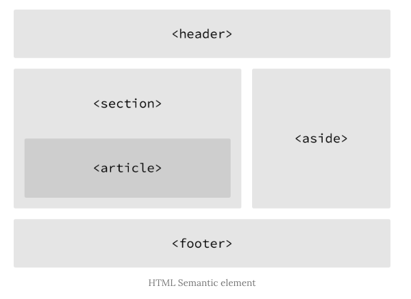

# HTML 정리

수업일: 2025년 3월 5일

## HTML ?

### HTML / CSS / JS 간단한 개념

- HTML : 웹사이트의 뼈대
- CSS : 웹사이트를 스타일링
- JS : 웹사이트에 움직임을 더함

### HTML 문서

파일은 `.html`로 끝난다.

<aside>

💡 반드시 `index.html` 을 만들어줘야 한다.

</aside>

### HTML 기본 태그

> `< >` 열린 태그 `< />` 닫힌 태그 : 열렸다면 꼭 닫아주기
> 
- 기본 템플릿
    
    `<!DOCTYPE html>` : 문서 형식을 HTML5로 지정
    
    `<html> </html>` : HTML document의 시작과 끝
    
    `<head> </head>` : document title, 외부 파일 참조, 메타데이터 설정 정보가 들어간다.
    
    `<body> </body>` : 출력되는 모든 요소. **단 하나만 존재**
    
    💭 템플릿 단축키 `!` → `tab`
    
- 웹페이지 구성
    
    `title` : 문서의 제목. 브라우저 탭에 표시됨.
    
    `style` : css 코드가 작성되는 곳
    
    `link` : 외부 리소스와의 연결에 사용. (같은 폴더 내 다른 파일 간 연결도 가능)
    
    `script` : javascrpit 를 작성할 때 사용
    
    `meta` : description, keywords, author, 기타 메타데이터 정의에 사용
    
- 텍스트 관련
    
    `h1` `h2` … `h6` : 제목 나타낼 때 사용
    
    `strong` : 볼드체, semantic 중요성 O
    
    `b` : 볼드체, semantic 중요성 X
    
    `em` : 이탤릭체, semantic 중요성 O
    
    `i` : 이탤릭체, semantic 중요성 X
    
    `sub` : 아래에 쓰인 텍스트
    
    `sup` : 위에 쓰인 텍스트
    
    <aside>
    
    💡 `&nbsp` : 공백을 삽입하는 방법. HTML에서는 여러개 공백을 입력해도 1개 공백으로 처리됨.
    
    </aside>
    
    `pre` : 파일에 작성된 그대로 (공백을 많이 두거나 …) 브라우저에 표시됨
    
    `q` : 짧은 인용문 지정, 큰 따옴표로 보여짐
    
    `blockquote` : 긴 인용문 지정, 들여쓰기가 되어짐
    
- 목록
    
    `ul` : 순서 없는 목록
    
    `ol` : 순서 있는 목록
    
    `li` : `ul` 과 `ol` 의 구성요소
    
- 멀티미디어 지원
    
    `img`
    
    | attribute | Description |
    | --- | --- |
    | src | 이미지 파일 경로 |
    | alt | 대체 텍스트 |
    | width | 너비 |
    | height | 높이 |
    
    `audio`
    
    | attribute | Description |
    | --- | --- |
    | src | 음악 파일 경로 |
    | preload | 재생 전 모든 음악 파일을 불러올 건지 |
    | autoplay | 자동 재생 |
    | loop | 반복 재생 |
    | controls | 음악 재생 도구 표시 |
    
    `video`
    
    | attribute | Description |
    | --- | --- |
    | src | 동영상 파일 경로 |
    | poster | 동영상 준비 중에 표시될 이미지 파일 경로 |
    | preload | 재생 전 모든 동영상 파일을 불러올 건지 |
    | autoplay | 자동 재생 |
    | loop | 반복 재생 |
    | controls | 동영상 재생 도구 표시 |
    | width | 너비 |
    | height | 높이 |
    
    `source`
    
    : `audio` 와 `video` 는 웹 브라우저 별로 지원하는 파일 형식이 달라 문제가 발생할 수 있기 때문에 `source` 태그로 해결할 수 있다.
    
- 사용자 커뮤니케이션
    
    `form` : 사용자가 입력한 데이터 수집을 위해 사용
    
    | attribute | Value | Description |
    | --- | --- | --- |
    | action | URL | 입력 데이터가 전송될 URL 지정 |
    | method | get / post | 입력 데이터 전달 방식 지정 |
    
    <aside>
    
    `HTTP Request Method` **(면접 단골 질문)**
    
    - GET : 서버에 데이터 조회 요청
    - POST : 특정 데이터 생성 요청
    </aside>
    
    `input` : 사용자로부터 데이터를 입력 받기 위해 사용됨
    
    (아래는 자주 사용되는 것들)
    
    | type | Description |
    | --- | --- |
    | button | 버튼 생성 |
    | checkbox | checkbox 생성 |
    | date | date 생성 |
    | file | 파일 선택 form 생성 |
    | password | password 입력 form 생성 |
    | radio | radio button 생성 |
    | submit | 제출 button 생성 |
    
    `select` : 복수 개 리스트에서 복수 개 아이템 선택
    
    | tag | Description |
    | --- | --- |
    | select | select form 생성 |
    | option | option 생성 |
    | optgroup | option을 그룹화한다 |
    
    `textarea` : 여러 줄 글자를 입력 받을 때 (종종 쓰임)
    
    `button` : 버튼 생성
    
- 웹페이지 레이아웃 구성 (공간 분할)
    
    
    
    `div` : 의미론적으로 어떠한 의미도 가지지 않음. → 좋은 방법이 아님.
    
    여태껏 `div` 만 썼었는데, 태그 사용에 신경을 써야겠다.
    
    
    
    | tag | Description |
    | --- | --- |
    | header | 헤더를 의미 |
    | nav | 내비게이션을 의미 |
    | aside | 사이드에 위치하는 공간을 의미 |
    | section | 본문의 여러 내용(article)을 포함하는 공간을 의미 |
    | article | 분문의 주내용이 들어가는 공간을 의미 |
    | footer | 푸터를 의미 |

### `요소 (Element)`

구성 : `<시작태그>` 콘텐츠 `</종료태그>`

> 중첩 요소 : 요소는 다른 요소를 포함 가능
> 

❗️중첩 요소 적을 때 꼭 **들여쓰기** 하기

> 빈 요소 : 콘텐츠를 가질 수 X. Attribute만 가질 수 있음.
> 

Attribute ?

: 요소에 추가적인 정보를 제공함.

```html

```

- 위 예시에선 src, width, height 가 해당.

> 글로벌 어트리뷰트
> 

| Attribute | Description |
| --- | --- |
| id | 유일한 식별자(id)를 요소에 지정. 중복 지정 불가 |
| class | 스타일시트에 정의된 class를 요소에 지정. 중복 지정 가능 |
| hidden | css의 hidden과는 다르게 의미상으로도 브라우저에 노출되지 않게 됨. |
| lang | 지정된 요소의 언어를 지정. 검색엔진의 크롤링 시 웹페이지의 언어를 인식할 수 있게 함. |
| style | 요소에 인라인 스타일을 지정. |
| tabindex | 사용자가 키보드로 페이지를 내비게이션 시 이동 순서를 지정. |
| title | 요소에 관한 제목을 지정. |

> 주석 : 개발자에게 코드 설명을 위함
> 

### Hyperlink

`a` : 다른 웹사이트나 페이지로 이동할 수 있게 하는 역할

| attribute | Value | Description |
| --- | --- | --- |
| href | 절대 경로 | **현재 작업 디렉토리와 관계없이** 파일의 절대적인 위치 |
| | 상대 경로 | **현재 작업 디렉토리 기준** 파일의 상대적인 위치 |
| target | `_self` | 링크 클릭 시 연결 문서를 현 윈도우에 오픈 (기본값) |
| | `_blank` | 링크 클릭 시 연결 문서를 새 윈도우나 탭에서 오픈 |


<aside>

💡 피싱 공격 방지를 위해 `rel=”noopener noreferrer”` 추가할 것을 권장

</aside>

### 시맨틱 태그 (semantic tag)?

: 브라우저, 검색 엔진, 개발자 모두에게 콘텐츠의 의미를 명확히 설명하는 역할

<aside>

💡 **왜 사용할까 ?**

검색 엔진이 HTML 코드들로 해당 코드의 의미를 파악해야 하기 때문에 사용

하지만 각 요소마다 사용할 태그는 개발자의 자유

</aside>

### 웹 표준, 웹 접근성 ?

> `웹 표준` : 표준화된 언어를 사용해 어떠한 브라우저를 사용하더라도 동일한 결과물을 보여주는 것
> 

<aside>

✅ 웹 표준의 장점

- 운영 관리 용이
- 검색 엔진 최적화
- 웹 접근성 향상
</aside>

> `웹 접근성`
> 

<aside>

✅ 웹 접근성을 높이는 방법

- `alt` 속성 사용
- modal을 사용할 때, `dialog` 태그 사용
</aside>

`dialog` 가 제공하는 웹 접근성 기능

- 포커스 관리
- 접근성 트랩
- 모바일 네이티브 이벤트 구현

`dialog` 사용 방법

- ShowModal() : 모달식 대화상자 오픈 → 외부요소와 상호작용 X