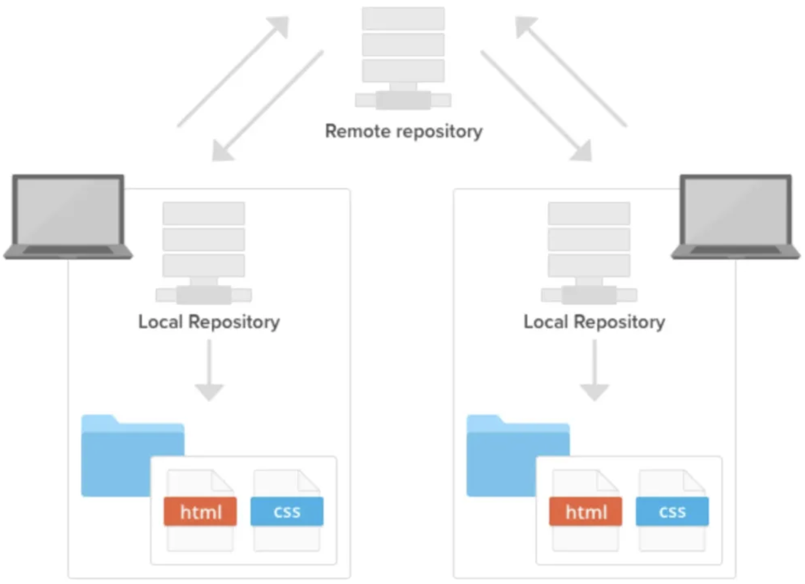

## Git이란?

⇒ 분산형 버전 관리 시스템의 한 종류

## Git을 쓰는 이유?

⇒ 버전 관리를 위해서

- 자세하게 좀 알아보자면..(상황극)
    1. 나와 내 동료가 같은 웹사이트에서 동시에 같은 ‘A’ 페이지를 업데이트 하고 있다.
    2. 나는 무언가를 변경하고 저장한 다음 웹사이트에 ‘A’ 페이지를 업로드한다.
    3. 그런데 이 때 동료가 동시에 ‘A’ 페이지에서 작업을 할 때 문제가 발생된다.
    4. 만약 확인하지 않고 동시에 작업한다면 누군가의 작업은 겹쳐 쓰여질 것이고 지워질 것이다.
    5. Git은 이와 같은 일을 사전에 방지해준다.
    6. 나와 동료는 같은 페이지에 각자 수정사항을 업로드 할 수 있고, 두 개의 복사본을 저장한다.

## 버전 관리 시스템

- 파일 변화를 시간에 따라 기록했다가 나중에 특정 시점의 버전을 다시 꺼내올 수 있는 시스템
- 장점(Git의 장점)
    - 각 파일을 이전 상태로 되돌릴 수 있다.
    - 프로젝트를 통째로 이전 상태로 되돌릴 수 있다.
    - 시간에 따라 수정 내용을 비교해 볼 수 있다.
    - 누가 문제를 일으켰는지 추적할 수 있다.
    - 누가 언제 만들어낸 이슈인지 알 수 있다.
    - 파일을 잃어버리거나 잘못 고쳤을 때 쉽게 복구할 수 있다.
    

## 결론, Git을 사용하면 이런게 좋다. ⭐⭐⭐

1. 여러 명이 동시에 작업하는 병렬 개발이 가능하다.
2. 분산 버전 관리이기에 인터넷이 연결되지 않은 곳에서도 개발을 진행할 수 있다.
3. 중앙 저장소가 날라가 버려도 원상 복구를 진행할 수 있다.
4. 체계적인 개발이 가능해진다.

## Git이 파일을 관리하는 방법

- Committed: 데이터가 로컬 데이터베이스에 안전하게 저장됐다는 것을 의미한다.
- Modified: 수정한 파일을 아직 로컬 데이터베이스에 커밋하지 않은 것을 말한다.
- Staged: 현재 수정한 파일을 곧 커밋할 것이라고 표시한 상태를 의미한다.

이건 무슨 뜻인가요

- Git directory: Git이 프로젝트의 메타데이터와 객체 데이터베이스를 저장하는 곳. 이 Git 디렉토리가 Git의 핵심임
(다른 컴퓨터에
- Working Directory(혹은 working tree): 저장소를 어느 한 시점을 바라보는 작업자의 현재 시점, 파일 수정 및 저장 드으이 작업을 하는 디렉토리
- Staging Area: Git directory에 있고, 곧 커밋할 파일에 대한 정보를 저장한다. 즉, 커밋을 준비하는 like 장바구니..?
    - 이 장바구니 담을 때 사용하는 명령어는 `git add`

## 결론, Git으로 하는 일은 뭐에요?

1. 워킹 트리에서 파일 수정
2. Staging Area에 파일을 Stage해서 커밋할 스냅샷 생성 → 모든 파일을 추가할 수도 있고 선택하여 추가할 수도 있다.
3. Stagin Area에 있는 파일들을 commit해서 Git 디렉토리에 영구적인 스냅샷으로 저장한다.
4. 즉, 우리의 코드를 기록

## Git 용어

- Repository: staging area에서 대기하고 있던 파일들을 버전으로 만들어 저장하는 곳
    - Git은 원격 저장소와 로컬 저장소 두 종류의 저장소를 제공
    - 원격 저장소( remote repository ): 파일이 원격 저장소 전용 서버에서 관리되며 여러 사람이 함께 공유하기 위한 저장소
        - 로컬에 있는 내 작업들을 원격 저장소에 반영할 때 사용하는 명령어: git push
    - 로컬 저장소( local repository ): 내 PC에 파일이 저장되는 개인 전용 저장소
        - 로컬에서는 내가 실수를 하던 말던 괜찮다. 하지만 원격 저장소에 올릴 때에는 여러 개발자가 함께 공유하기 때문에 주의해야 한다.
        - 저장소 만드는 방법 1: 아예 저장소 새로 만들기 `git init`
        - 저장소 만드는 방법 2: 이미 만들어져 있는 원격 저장소를 로컬 저장소로 복사해 올 수 있다. `git clone`

- SnapShot(스냅샷): 특정 시점에서 파일, 또는 워크스페이스의 상태를 의미
    - 역할
        - 특정 시점에 어떤 파일에 어떤 내용이 기록되어 있었는지, 폴더 구조는 어떠했는지, 어떤 파일이 존재했는지 등 저장소의 모든 정보를 확인할 수 있음
    - 저장 방법
        - 새로운 버전을 기록하기 위한 명령인 커밋을 실행하면 스냅샷이 저장
- commit(커밋): 현재 변경된 작업 상태 점검을 마치면 확정하고 저장소에 저장하는 작업

- checkout: 이전 버전 작업을 불러오는 것
- HEAD: 현재 작업 중인 브랜치(Branch)
- ⭐⭐⭐ 브랜치(Branch): 분기점을 의미, 작업을 할 때 현재 상태를 복사하여 브랜치에서 작업 후 완전하다 싶을 때 merge를 진행

## Git 호스팅 웹 서비스 - Github vs GitLab

: 깃 저장소 서버를 대신 유지 및 관리해주는 서비스(원격 저장소)

- Github: 주로 개인 혹은 사이드 프로젝트
    - 세계 최대 규모의 Git 저장소, 무료 서버 저장소
    - 소스코드가 오픈되어 사람들이 보며 활용 가능 + 익명의 개발자와 작업 진행 ⇒ 프로그래밍 확산
- GitLab: 주로 회사가 사용
    - 자신의 서버에 설치해 서버 내 private한 Git 원격 저장소를 만들 수 있는 서비스
    - 유료, 대신 치밀한 보안성을 중시하는 프로그램 코드를 올릴 수 있음