## git branch

→ 프로젝트에서 여러 작업을 나눠 병렬로 진행할 수 있는, 버전 관리의 각 분기점을 branch

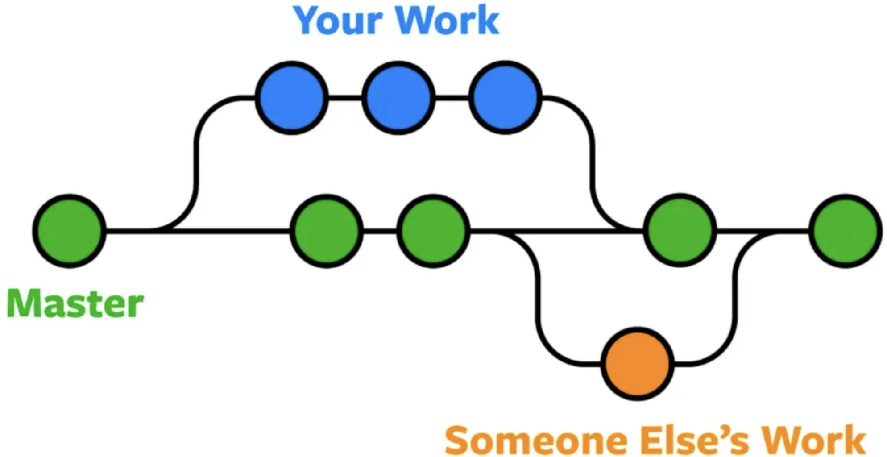

하나의 개발 프로젝트에 참여하는 개발자가 둘이라고 가정
→ 한 명이 개발 다 하면 그 뒤로 다른 한 명이 개발할 것? << 시간 낭비
→ 서로 기능 정하고 동시에 작업하는 경우가 대부분

**이걸 도와주는 git 시스템이 branch라는 것**

## branch를 따서 작업하려면 merge를 알아야 하는데..

: merge(병합)란? 서로 작업 내용을 합쳐야 할 때 사용

### 예를 들어.

1. 한 웹사이트에서 뭔가 작업을 진행
2. 새로운 이슈를 처리할 때 Branch를 새로 따서 작업
3. 치명적인 에러가 생겨 Hotfix를 먼저 만들어야 함
4. 해오던 작업의 브랜치가 파생된 시점으로 이동
5. Hotfix 브랜치 생성 후 에러 수정
6. 운영 브랜치로 Merge 진행
7. 진행하던 브랜치로 돌아와 하던 일 진행

### 그럼 방법은?

브랜치 병합에는 여러가지 방법이 존재.

- 3-way merge
- fast-forward merge
- rebase and merge
- squash and merge

### 3-way merge

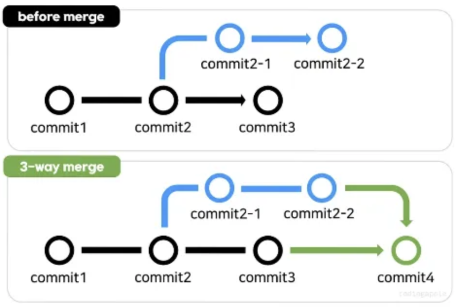

브랜치 각각 신규 커밋이 1회 이상 있는 경우, merge를 하면 두 브랜치의 코드를 합쳐서 새로운 커밋을 자동으로 생성해준다.

### fast-forward merge

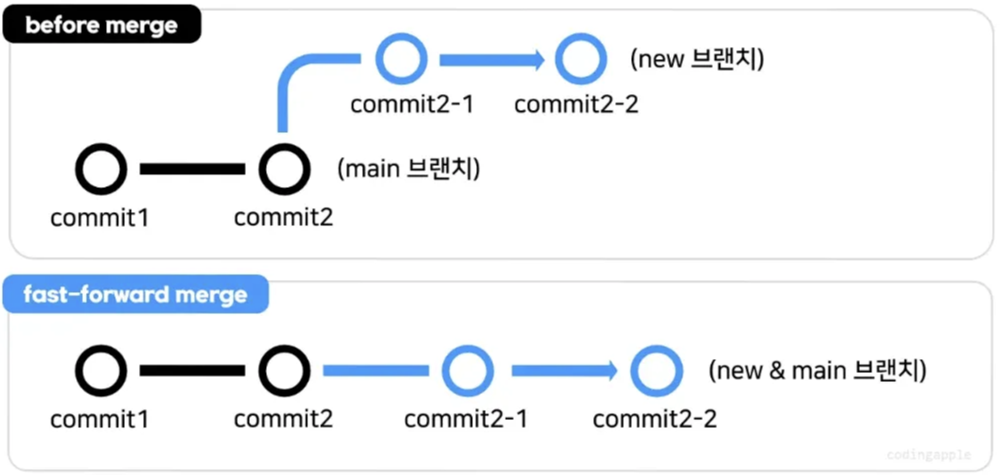

새로운 브랜치에만 커밋이 있고, 기준이 되는 브랜치에는 신규 커밋이 없는 경우에 병합(merge commit이 생성되지 않음)

- 조금 더 디테일하게 설명하자면..
    
    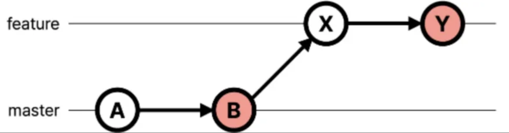
    
    1. master branch의 HEAD commit > B 인 상태에서 feature branch를 생성
    2. 생성된 feature branch는 새로운 커밋을 2개 생성 (X, Y)
    3. feature branch 커밋 내역을 확인 해보니, master branch의 모든 커밋을 가지고 있다. << master branch에 신규 커밋이 없다는 얘기
    4. master branch에서 feature branch를 merge하게 되면 fast-forward 방식으로 인해 단순히 master의 HEAD 위치가 commit Y로 이동하게 된다.
    
    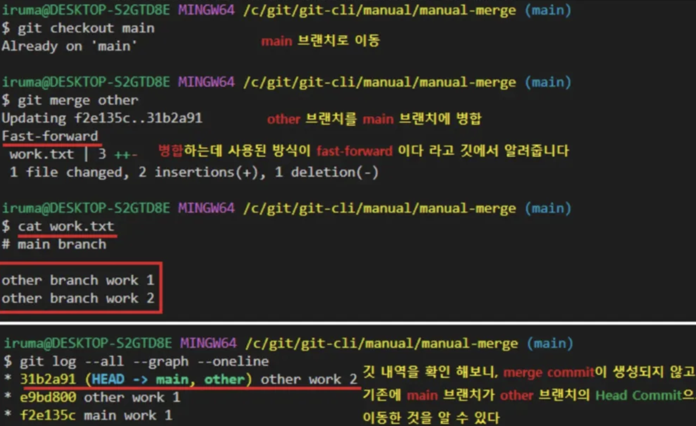
    
    명령어로 merge를 진행해보니 merge commit이 생성되지 않고 fast-forward로 진행되었다고 알려주는 스윗보이 git
    

<aside>
💡merge 진행 후엔 기존 branch를 삭제해야 한다~
</aside>

### rebase and merge
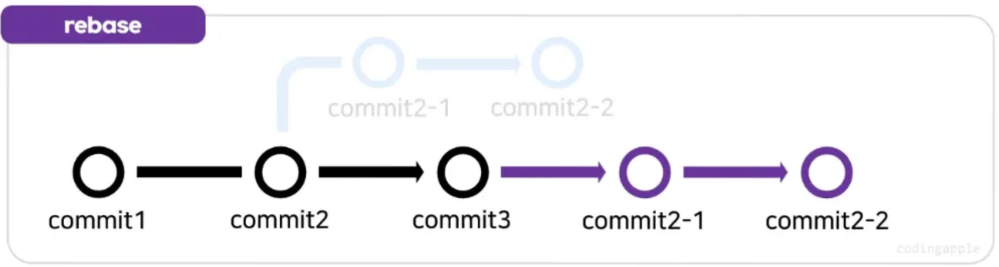

rebase: 신규 브랜치의 시작점을 main 브랜치의 최근 커밋으로 이동하는 것

<aside>
💡3-way merge하면 되는거 아님?

1. 3-way merge는 git log가 더러워짐
2. 브랜치 커밋이 간단하거나 짧을 때 깔끔해보일 수 있다.
3. commit 내역을 한 줄로 계속 이어 남기고 싶을 때 유용하다.
</aside>

이거 하면 conflict가 많이 발생한다. branch끼리 코드 변경 차이가 많은 경우 rebase하면 충돌이 많이 발생하는데 하나하나 해결하기 귀찮다. << rebase를 자주해주기

- 그래서 어떻게 하나요
    
    ```jsx
    git switch 새로운 브랜치
    git rebase main
    
    git switch main
    git merge 새로운 브랜치
    ```
    
    1. 새로운 브랜치 이동
    2. `git rebase <merge하고픈 브랜치명>`
    3. merge하고픈 브랜치로 이동 후 `git merge <새로운 브랜치명>`

### squash and merge

- 3-way merge의 단점
    
    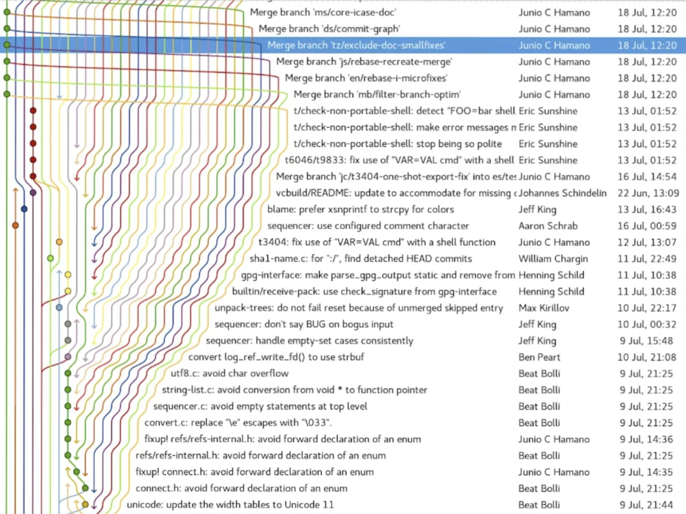
    
    위 사진과 같이 git graph가 아주 더러워지는 것을 확인할 수 있음. 이를 방지하기 위해 rebase 혹은 squash를 선택하는 것
    
- 스쿼시란?
    
    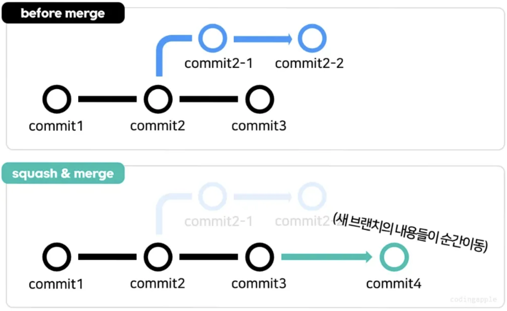
    
    3-way처럼 선으로 이어주지 않고, 새 브랜치의 코드 변경사항들을 병합하는 브랜치로 텔레포트 시켜주는 것
    
    스쿼시 진행 후 main 브랜치에서 git log를 출력해보면 merge 완료된 브랜치의 commit들은 출력되지 않음.
    
- 하는 방법
    
    ```jsx
    git switch main
    git merge --squash 브랜치명 // 여러분이 브랜치에서 만들었던 커밋들을 다 합쳐서
    git commit -m "message" // 하나의 커밋으로 main 브랜치에 생성해주는 과정임.
    ```
    

## 통합 심화버전

- squash and merge with rebase
    
    ⇒ 정식 명칭은 Git rebase interactive: 기존 커밋을 수정, 삭제, 이동, 생성이 가능함
    

### 사용 방법

1. `git rebase -i <수정할 커밋의 직전 커밋 아이디>` or `git rebase -i HEAD~숫자`
    1. `git rebase -i <수정할 커밋의 직전 아이디>` : 여기에 적은 커밋아이디 그 다음부터 현재 커밋까지 모든 커밋을 가져옴(추천 방법)
    2. `git rebase -i HEAD~3` : 최신 커밋으로부터 HEAD를 포함해 3번째 커밋까지 가져옴
2. 입력하면 5가지 옵션 사용이 가능함
    
    ```jsx
    pick - 커밋 순서를 재정렬하거나 해당 커밋을 수정 없이 그대로 사용한다는 의미
    reword - 커밋 메시지 수정
    edit - 커밋 수정
    squash - 이전 커밋과 merge 하여 단일 커밋으로 변경
    fixup - squash와 비슷하지만 기존 커밋 메시지를 무시
    drop - 커밋을 삭제
    ```
    
3. 5가지 옵션 중 원하는 동작 선택 후 continue를 통해 작업 완료

### 언제 쓰냐?

- 커밋 메시지 오타
- 테스트 커밋이 잘못 올라갔을 때
- 비슷한 커밋이 두 개로 분리되어 있을 때
- 커밋 수정

위 작업을 rebase의 현재 작업 중인 브랜치의 최신 커밋을 가리키는 HEAD 포인터를 이동시킬 수 있다는 특성을 이용해 과거 커밋 히스토리를 수정할 수 있음

### 실제 사용

1. git log로 커밋 아이디를 확인한다.
    
    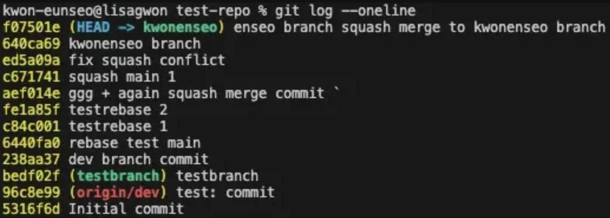
    
    이 상황에서 testrebase 1과 testrebase 2를 squash하여 하나의 commit으로 만들어보자
    
2. 수정하려는 커밋의 이전 커밋 아이디를 입력해야 한다.
    
    ⇒ `git rebase -i 6440fa0`
    
3. 위 명령어를 입력 시 vim이 켜진다.(위에서부터 오래된 커밋순)
    
    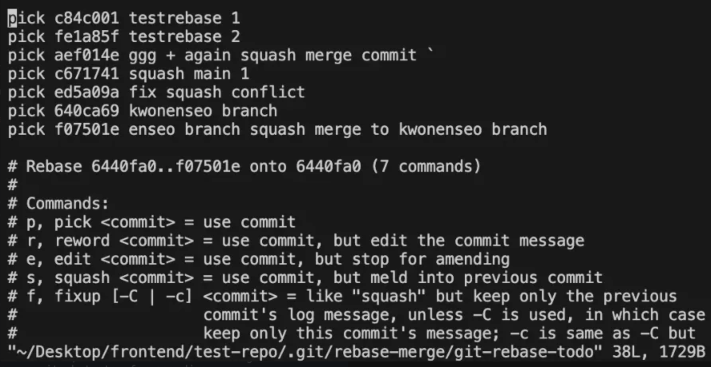
    
4. i를 입력하면 수정할 수 있다.
5. 아래 사진과 같이 testrebase 2 커밋 아이디 앞에 pick을 s로 바꾼다
    
    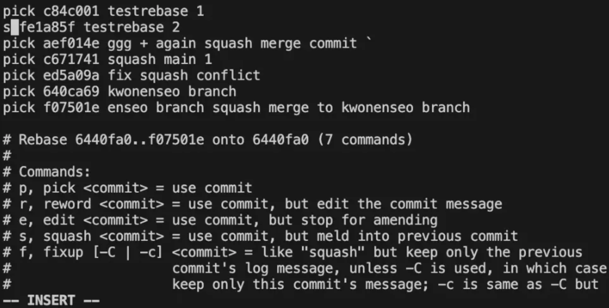
    
6. esc → :wq를 입력하여 vim을 탈출한다.
7. 2개의 커밋을 어떤 commit message로 합칠 것인지 적을 수 있는 vim 창이 나온다.
    
    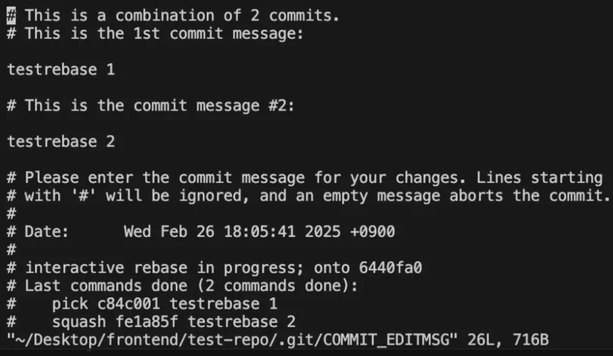
    
8. i를 누르고 맨 위에 commit message를 작성한 후 esc → :wq를 입력하여 vim을 탈출한다.
    
    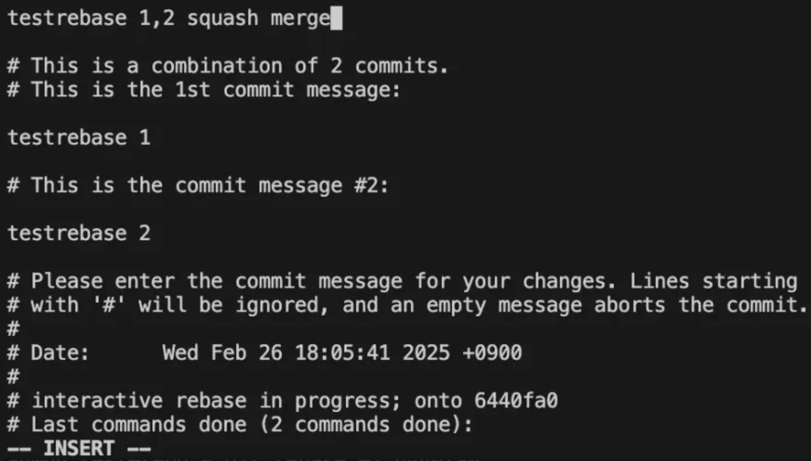
    
9. 그럼 잘 스쿼시 됐다고 메시지를 띄운다.
    
    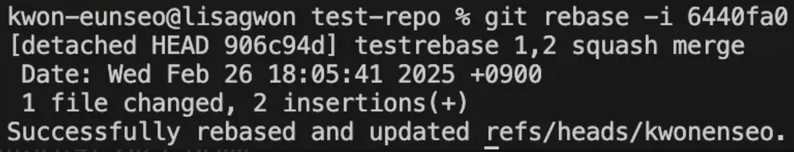
    
10. git log --oneline을 통해 확인도 해보자.