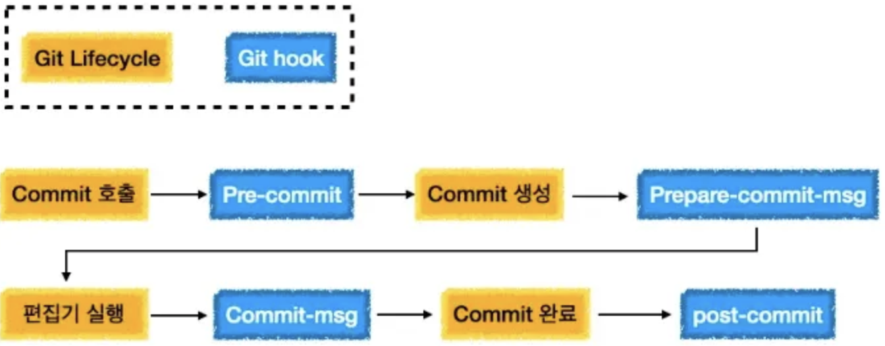

## Git hook이란?

⇒ Git에서 어떤 이벤트가 생겼을 때 자동으로 특정 스크립트를 실행할 수 있게 하는 것

- 클라이언트 훅 → 주로 활용하는 hook만
    
    
    
    - `pre-commit`
        - 실행 시점
            - commit 시 가장 먼저 호출, commit 메시지 작성 전에 호출
        - 용도
            - commit하는 친구의 snapshot을 점검
            - commit 할 때 꼭 확인해야 하는 부분 있는 경우
            - lint로 코드 스타일을 검사
            - 라인 끝의 공백 문자를 검사
            - 테스트 확실히 했는지
        - 검사 후 exit 코드가 0이 아니면 commit 취소
            - `git commit --no-verify` 실
    - `prepare-commit-msg`
        - 실행 시점
            - git이 commit 생성 → `prepare-commit-msg` → 편집기를 실행하기 전
            - 사람이 커밋 메시지를 수정 전 + 프로그램이 커밋 메시지를 손보고 싶을 때
        - 용도
            - commit 메시지를 자동으로 생성하는 commit에 이용
            - commit 메시지에 Template 적용 | Merge 커밋 | Squash 커밋 | Amend 커밋
            - commit-msg
    - `commit-msg`
        - 싱행 시점
            - 최종적으로 commit이 완료되기 전 → 프로젝트 상태 | 커밋 메시지 검증
        - 0이 아닌 값을 반환하면 커밋 x
    - post-commit
        - 실행 시점
            - commit 완료 후
        - 용도
            - 커밋 된 것을 누군가 or 다른 프로그램에게 알릴 때 사용

> 💡 git hook 제어를 간편하게 하기 위한 [Husky](https://typicode.github.io/husky/#/?id=automatic-recommended) 란 툴이 있음