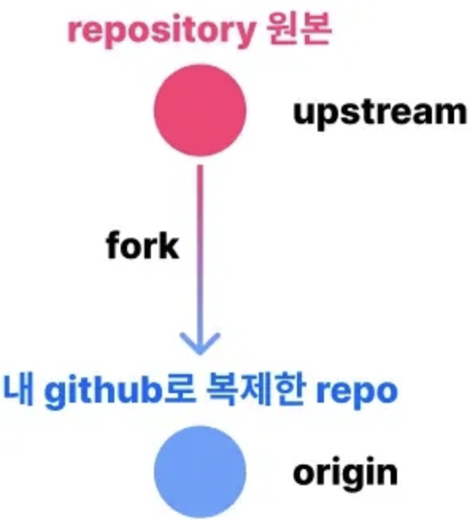

## 협업해보기

### git clone

- 원격 저장소에 있는 프로젝트를 내 로컬 컴퓨터에 그대로 복제해오는 것

### fork



- 다른 사람의 레포를 내 소유의 레포로 복사하는 것
- 위 사진의 upstream, origin은 원격 저장소 별칭 → 암묵적으로 사용하는 약속 별칭
- 하는 방법
    1. fork하고 싶은 레포지토리를 들어가 우측 상단에 fork를 찾는다.
    2. fork를 누르고 나오는 페이지의 하단에 create fork를 진행해준다.
- upstream, downstream
    - origin과 local을 기준으로 생각하면 `origin = upstream` / `local = downstream`
    - fork repo를 기준으로 생각하면 원본 `repo = upstream` / `origin = downstream`

### 깃헙으로 협업할 때 진행 과정

1. ‘원본 remote repository’ (upstream)를 깃허브에서 fork
2. ‘fork한 remote repository’ (origin)를 깃 클라이언트(내 로컬)로 clone
3. 기능을 완성할 때까지 아래 반복
    1. clone한 repository(즉, 내 로컬)에 개발 & commit
    2. local에서 origin(즉, 내 깃헙의 복사한 레포)으로 push
4. 기능이 완성되면 upstream에 반영
    1. PR을 등록하기 전 upstream에 바뀐 내용이 없는 경우
        1. origin에서 upstream으로 PR(Pull Request)
    2. PR을 등록하기 전 upstream에 바뀐 내용이 있는 경우
        1. upstream을 local로 Pull
            - `git remote add upstream 원본레포URL` → `git pull upstream 가져올브랜치 명`
        2. local에서 origin으로 push
            - `git push origin 브랜치명`
        3. origin에서 upstream으로 PR

### Pull Request(PR)

- 브랜치를 새로 파서 merge하기 전에 팀원과 코드 리뷰, 코드 검토, 토론해야 하는 경우가 있기에 PR을 진행
- PR에서 필요한 과정을 거치고 merge를 할 때는 여러가지 옵션이 있다.
    
    
    
    1. create a merge commit
        
        새로운 merge commit 하나 생성해주는 3-way merge 실행
        
    2. squash and merge
        
        합쳐질 브랜치의 commit 내역들을 하나로 합쳐 main 브랜치에 신규 commit을 생성
        
    3. rebase and merge
        
        합쳐질 브랜치를 main 브랜치의 최신 커밋으로 재배치하고 나서 fast-forward merge처럼 실행
        

### 코드 리뷰

- 한 개발자가 코드를 작성하면 다른 개발자가 정해진 방법으로 피드백을 주고 받는 과정
- 필요한 이유
    - 본인은 발견하지 못한 실수를 다른 사람이 발견해 코드의 부작용과 오류에 조기 대응 가능
    - 개발 내 정해진 컨벤션 규칙을 유지하고 기술의 부채를 줄일 수 있음
    - 여러 개발자가 참여함으로써 문제 해결을 위한 기술 구현 방법론에 대해 공유
- 5가지 규칙
    - 왜 개선이 필요한지 이유를 충분히 설명해야 함
    - 답을 알려주기보다는 스스로 고민하고 개선 방법을 선택할 수 있게 해줘야 함
    - 코드를 클린하게 유지하고, 일관되게 구현하도록 안내해야 함
    - 리뷰 과정은 숙제 검사가 아닌 학습 과정으로 느낄 수 있도록 신경 써서 리뷰해야 함.
    - 리뷰를 위한 리뷰를 하지 말자. 피드백할 것이 없다면 칭찬해주면 된다.

### 브랜치 규칙 설명하기

- 브랜치 규칙을 추가해야 주요 브랜치(main)로의 잘못된 병합을 방지할 수 있음
- 방법
    1. 브랜치 규칙 세팅할 레포에 들어가 New branch ruleset 클릭
        
        
        
    2. 용어들 설명 보면서 하나씩 설정
        
        
        
        1. Ruleset Name = 규칙의 이름
        2. Enforcement status = 규칙 상태
        3. Active = 활성화
        4. Bypass list = 규칙을 우회할 수 있는 역할 → 저장소의 소유자가 급할 때 push할 수 있도록 지정하거나 배포할 때 이상 없도록 bypass list 지정
    3. Targets에서는 보호할 대상 브랜치, 즉 push를 막을 브랜치를 선택
        
        
        
        Add target → Include by pattern → mian, release 등 원하는 패턴으로 지정
        
    4. 추가적으로 세부 규칙을 정할 수 있음
        
        
        
        - Required approvals:
            
            PR 병합에 필요한 최소 리뷰어 수를 지정. 지정된 리뷰어 수 이상이 승인해야 PR을 병합
            
        - Dismiss stale pull request approvals when new commits are pushed
            
            출처 브랜치에 새로운 커밋이 푸시되면, 이전 PR 승인이 취소. 예를 들어, 어떤 리뷰어의 승인을 받았는데, 이후에(병합 전) 코드가 변경되면 다시 승인이 필요하다는 의미
            
        - Require review from Code Owners
            
            특정 파일의 코드 소유자가 있는 경우, 해당 파일을 수정한 PR은 코드 소유자의 승인을 필수로 받아야 함.
            
        - Require approval of the most recent reviewable push
            
            코드 작성자가 자신의 코드를 승인할 수 없고 다른 리뷰어가 승인해야 함
            
        - Require conversation resolution before merging
            
            모든 리뷰가 해결(Resolve)돼야 PR 병합 가능
            
    5. 저장 후 규칙 활성화 확인
        
        
        
        
        

### 좋은 코드 리뷰를 받기 위한 좋은 PR 만들기

- commit을 다음 원칙들을 기억하며 막 하지 말자.
    1. 커밋의 순서를 정하자
        
        예들 들어, ‘파일 추가 → 화면 구성 → 기능 구현’
        
    2. 커밋은 작을수록 좋다
        1. 하나의 커밋은 하나의 작업 단위만 포함한다.
        2. 여러 페이지에 같은 기능을 추가한다 하여도 커밋을 나누자.
    3. 커밋 메시지에 의미를 부여하자
        1. Commit Convention
            1. 기본 커밋 컨벤션 구조
                
                ```jsx
                // 예시
                Feat: 회원 가입 기능 구현
                
                SMS, 이메일 중복확인 API 개발
                
                Resolves: #123
                Ref: #456
                Related to: #48, #45
                ```
                
            2. Commit Type
                
                
                | Tag Name | Description |
                | --- | --- |
                | Feat | 새로운 기능을 추가 |
                | Fix | 버그 수정 |
                | Design | CSS 등 사용자 UI 디자인 변경 |
                | !BREAKING CHANGE | 커다란 API 변경의 경우 |
                | !HOTFIX | 급하게 치명적인 버그를 고쳐야하는 경우 |
                | Style | 코드 포맷 변경, 세미 콜론 누락, 코드 수정이 없는 경우 |
                | Refactor | 프로덕션 코드 리팩토링 |
                | Comment | 필요한 주석 추가 및 변경 |
                | Docs | 문서 수정 |
                | Test | 테스트 코드, 리펙토링 테스트 코드 추가, Production Code(실제로 사용하는 코드) 변경 없음 |
                | Chore | 빌드 업무 수정, 패키지 매니저 수정, 패키지 관리자 구성 등 업데이트, Production Code 변경 없음 |
                | Rename | 파일 혹은 폴더명을 수정하거나 옮기는 작업만인 경우 |
                | Remove | 파일을 삭제하는 작업만 수행한 경우 |
            3. Footer 내용 : 선택사항, 보통 이슈 트래커를 적음
                
                ```jsx
                // 이슈 트래커 유형
                Fixes: 이슈 수정중 (아직 해결되지 않은 경우)
                Resolves: 이슈를 해결했을 때 사용
                Ref: 참고할 이슈가 있을 때 사용
                Related to: 해당 커밋에 관련된 이슈번호 (아직 해결되지 않은 경우)
                ```
                
            4. [gitmoji](https://gitmoji.dev/) 를 사용하는 사람도 있음
- Github ISSUE + PR Template 활용
    - issue (이슈)
        
        프로젝트의 기획, 작업, 개선사항, 버그 수정, 새로 추가될 기능 등 모든 것을 이슈라고 함.
        
    - projects
        
        깃헙에 있는 projects 탭은 말 그대로 프로젝트를 만들 수 있다.
        
        - 순서
            
            
            
            
            
            
            
            
            
    - ISSUE template 만드는 법
        1. github repo 들어가서 상단 탭에 settings에 진입
        2. Features 섹션에 Set up templates 클릭
        3. 진입 시 template 추가 버튼이 있음. 어떤 유형의 이슈 템플릿인지 선택
            1. Bug report = 버그 리포트
            2. Feature request = 기능 요청
            3. Custom template = 각 팀별로 개발 외 다른 용도로 이슈 사용
        4. 유형 선택 후 Preview and edit을 눌러 양식 수정
        5. 선택한 이슈 유형에 맞는 issue template을 작성
        6. 반드시 propose changes를 클릭해야 해당 변경 내용들이 커밋되어 저장됨
        7. commit message와 함께 main으로 바로 commit 버튼을 누른다.
    - ISSUE 작성법
        1. 이슈 만들 레포에 들어가 상단에 issue 탭 선택
        2. new issue 버튼을 누르고 우리가 만든 양식 유형의 이슈와 기본 빈 이슈 중 선택
        3. 우리가 만든 양식 유형을 선택 시 템플릿이 적용된 상태로 issue를 생성할 수 있음
    - PR Template 작성법
        
        vscode에서 .github 폴더를 만들고 안에 `pull_request_template.md` 파일을 만들고  원하는 형식 사용 → 형식은 구글에 찾아서 쓰기
        
    - PR 날리는 법
        1. PR을 날릴 레포에 들어가 상단에 Pull Requests 클릭
        2. 어떤 브랜치에서 어떤 브랜치로 merge를 할 것인지 선택
        3. 브랜치 재차 확인 후 create pull request 버튼 클릭
        4. 템플릿에 따라 내용을 적고, 최대한 구체적으로 적기