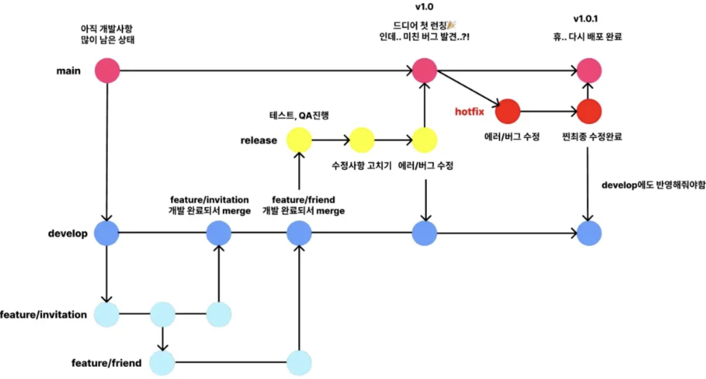
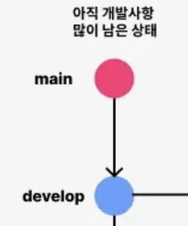
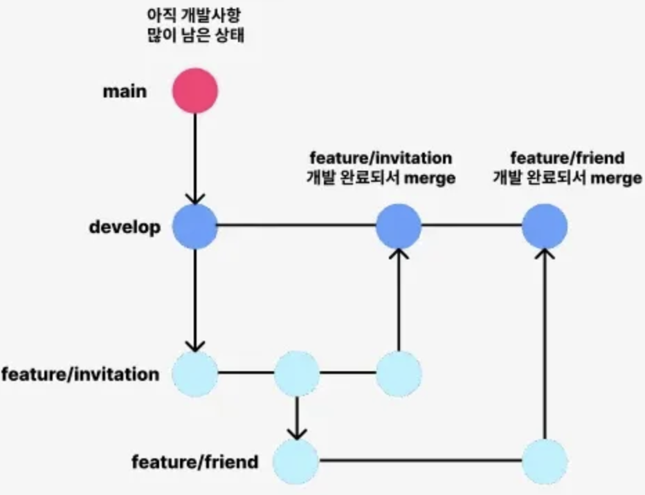
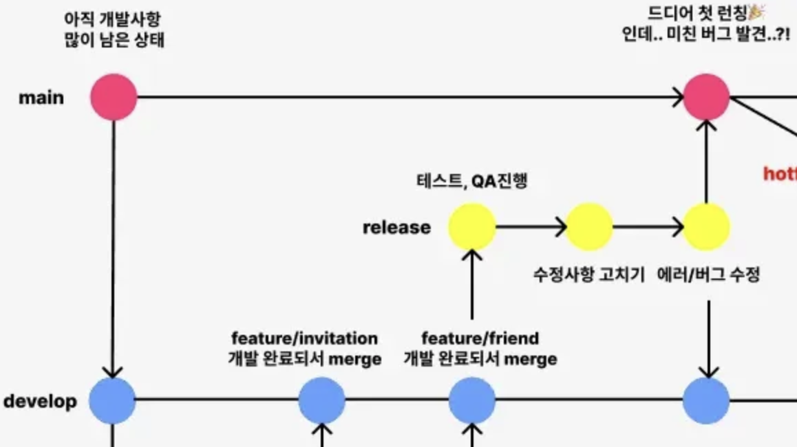
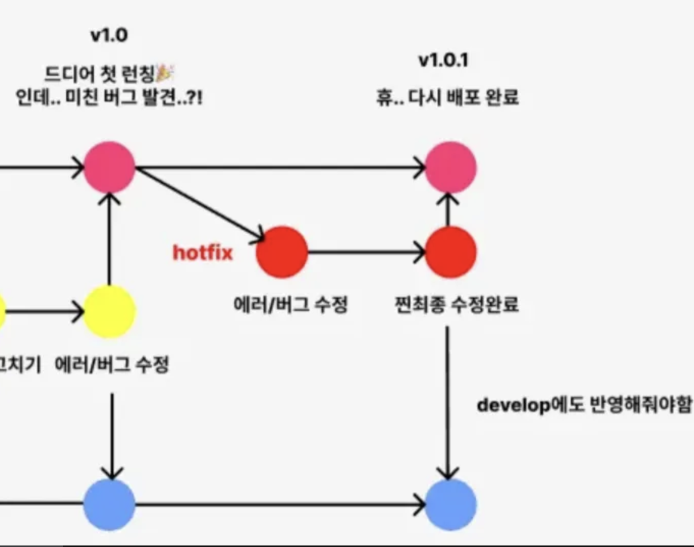
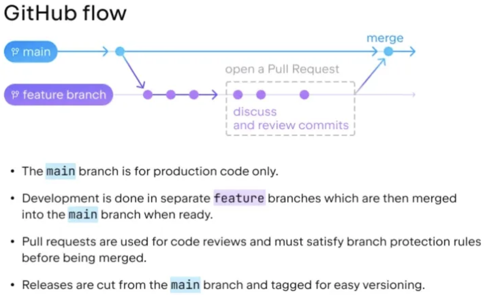
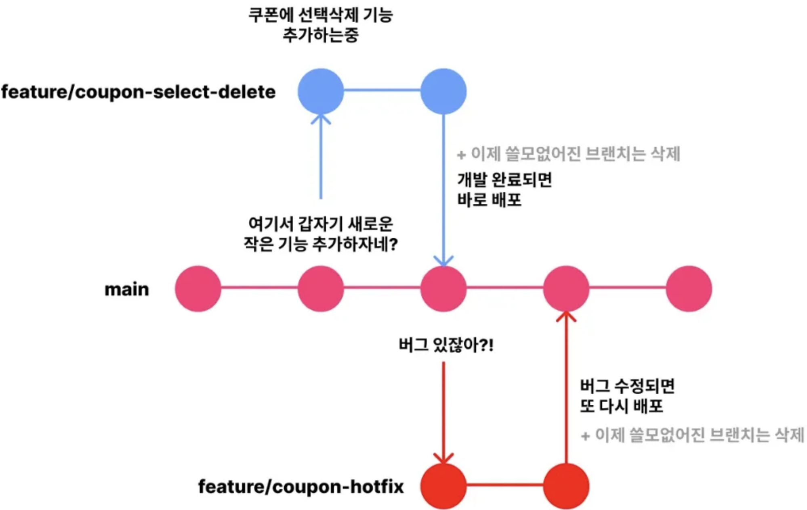
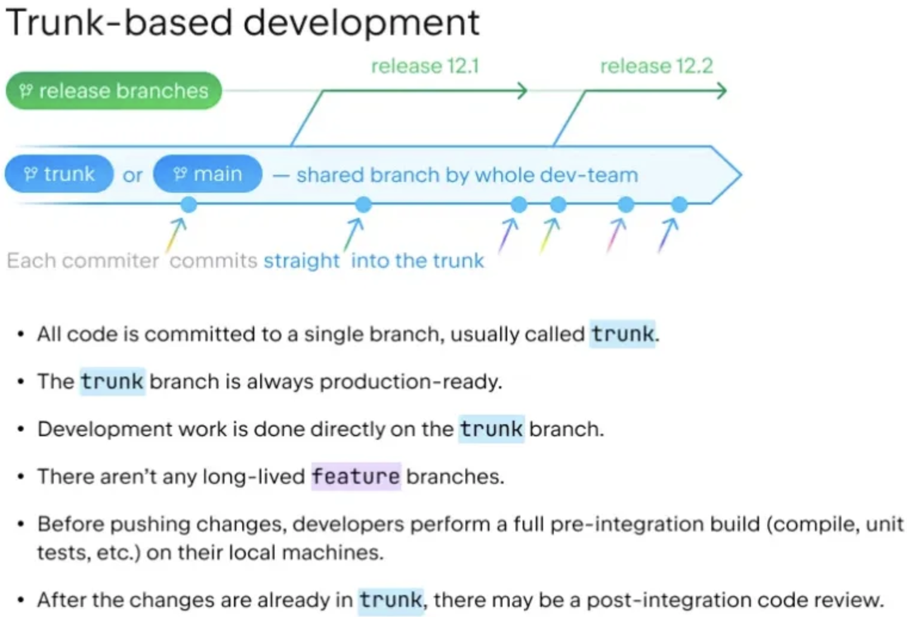

## Git 전략

- git flow, github flow, gitlab flow, trunk-based 등이 있음
- Git 전략 적용 시 브랜치 관리가 쉬워지고, 팀원이 많아도 개발 절차가 매끄러워짐

### git flow

- main 브랜치
    
    main 브랜치는 배포를 위한 코드만 존재한다. 오류없이 잘 진행되어야 한다.
    
- develop 브랜치
    
    팀원들이 개발을 진행하는 브랜치이다. 팀원 각자의 개발할 기능 역할을 지정하고 이 기능들을 개발하는 브랜치이다.
    

- feature 브랜치
    
    dev에서 바로 개발하는 것은 아니다. dev에서 feature/{기능 이름} 브랜치를 새로 파서 팀원 각자만의 브랜치를 만든다.
    
    예를 들어 `feature/invitation` 브랜치를 만들어 초대 기능을 만들고, `feature/friend` 브랜치를 만들어 친구 기능을 만드는 것이다.
    
    이 곳에서 각각의 기능이 개발된다면 develop 브랜치에 merge를 할 것이다.
    

- release 브랜치
    
    develop에는 새로운 기능 두 개가 merge된 상태다. 모든 기능이 개발되어 배포를 하려고 하는데 조금 쫄린다. 
    
    그럴 때 develop 브랜치에서 `release/1.0` 과 같이 브랜치를 만들어 QA 테스트를 진행 후 오류를 수정해준다.
    
    그런 다음에 main에 merge하여 최종 배포를 진행하는 것이다. 
    
    만약 release 브랜치에서 작업할 때 수정사항이 생겼다면 develop에도 merge하여 작업을 반영해야한다.
    

- hotfix 브랜치
    
    main 브랜치에서 배포를 완료했으나, 치명적인 버그를 발견했다.
    
    이럴 때에는 main 브랜치에서 hotfix 브랜치라는 브랜치를 파서 그 치명적인 버그를 수정해준다.
    
    그리고 다시 main에 머지하여 재배포를 진행해주고, develop에도 반영해 버그 수정사항을 반영해준다.
    

- git flow의 장점
    - 브랜치별 역할이 정해져 있음
    - 배포하기 전 release에서 배타 테스트와 수정 후 배포 → 안정적 버전별 배포 가능
    - 때문에 안정적인 배포를 해야할 때와 버전 별로 차곡차곡 배포를 하고 싶을 때 적용하면 좋다.

> 💡위에서 브랜치 작업은 자유롭게 변형해도 좋다. 하지만 이 변형에는 이유가 있어야 할 것이다. 우리의 git flow는 왜 이렇게 진행을 했으며, 이로 인해 어떤 좋은 결과를 보았는지가 있어야 한다.

### github flow

- trunk-based랑 거의 비슷
- PR로 merge를 진행하는 것이 github flow의 특징

### trunk-based - 브랜치 하나만 잘 관리하는 전략

1. 기능 추가, 버그 수정이 필요하면 main 브랜치에서 새로운 브랜치를 하나 만들어 코드를 짠다(브랜치명이 중요).
2. 기능이 완성되면 main 브랜치에 merge
3. 합치고 나서 쓸모없어진 브랜치는 삭제
4. main 브랜치에 있는 코드를 필요할 때마다 유저들에게 배포

- trunk-based의 장점
    - 코드를 한 브랜치에서만 관리하기에 편리
    - 크게 개발해서 한 번에 merge 하는 것 보다는 작은 단위로 merge하는 것이 안전
- 단점
    - main 브랜치 코드에 오류가 있으면 큰일남. → 코드 리뷰 자주 진행
    - 테스트를 자주하고 자동화 필수
- 코드를 바로 유저에게 배포해도 상관 없을 때, 대격변의 업데이트를 안하는 안정적인 프로그램일 때 사용하면 적합하다.