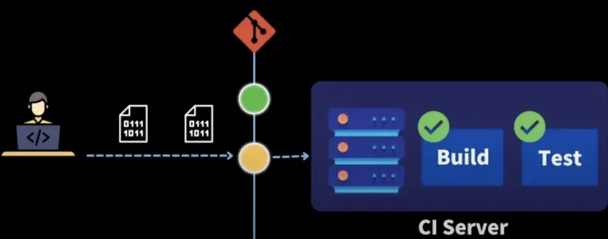
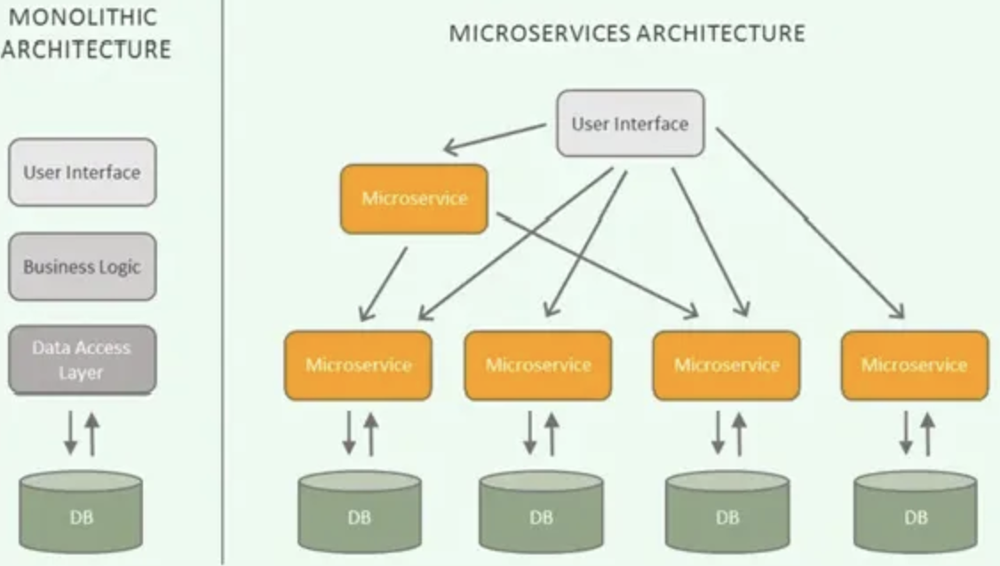
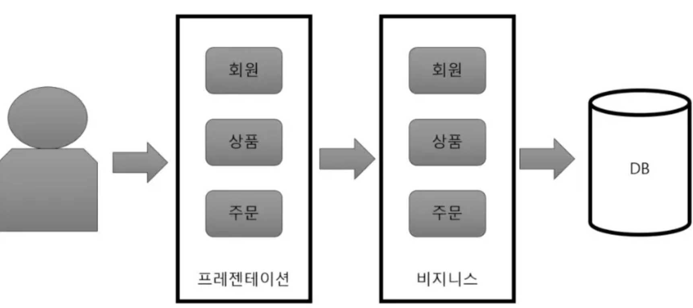
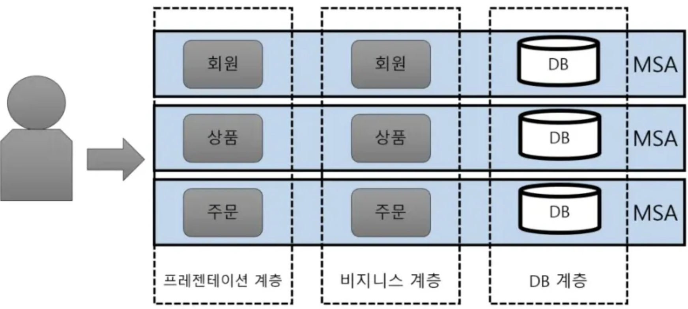

## CI/CD 개념 짚고 가기

> ➡️ CI/CD가 나오게 된 배경
요즘 같이 빠르게 변화하고, 기술이 진화하는 시대에 어떻게 시장과 고객의 요구에 빠르게 대응하고 반응하여 제품을 출시하고, 업데이트할 것인가 가 기업들의 큰 과제다. 이 과제를 해결하여 빠르게 반응하고, 배포하기 위해 CI/CD 개발 프로세스를 사용하는 것
> 
- CI/CD란?
    
    어플리케이션 개발 단계부터 배포 떄까지 이 모든 단계를 자동화해서 사용자에게 빈번하게 배포할 수 있도록 만드는 것
    
- CI = Continuous Integration(지속적인 통합)
- CD = Continuous Delivery(지속적인 제공) 혹은 Continous Deployment(지속적인 배포)

## CI가 뭔가요

버그 수정이나 새로 만드는 기능들이 메인 레포에 주기적으로 build되고 test가 되어서 merge되는 것
한마디로 **빌드/테스트 자동화 과정**

## CI의 중헌 포인또 ⭐⭐⭐

1. 코드 변경사항을 주기적으로 빈번하게 머지해야 한다.
    1. 한 기능을 구현할 때 한 번에 머지하지 말고 조각을 잘 나눠 최대한 작은 단위로 개발하고 머지하며 통합하는 것이 중요
    (몰아서 큰 단위로 머지하면 빌드, 테스트 과정에서 에러가 날 확률이 높다)
    2. 통합을 위한 단계 (빌드, 테스트, 머지)의 자동화
        
        
        
        개발자가 코드 리뷰 받아서 레포에 올리면 개발팀이 만든 CI 스크립트를 통해서 추가된 코드와 함께 레포가 빌드되고, 빌드 잘 되면 팀에서 작성한 여러 가지 테스트들도 스크립트를 통해 실행이 된다.
        이렇게 빌드도 잘 되고 테스트도 잘 되면 green 사인으로 바뀌면서 나중에 배포할 때 반영 가능하고, 만약 새로운 코드의 빌드나 테스트 둘 중 하나가 실패하게 되면 red 사인이 뜨면서 개발자에게 알려준다.
        

## CI의 장점

1. 개발 생산성 향상
    
    애플리케이션에 대한 새로운 코드 변경 사항이 정기적으로 빌드 및 테스트되어 공유 레포지토리에 통합되므로 여러 명의 개발자가 동시에 애플리케이션 개발과 관련된 코드 작업을 할 경우 **서로 충돌할 수 있는 문제를 해결할 수 있음**
    
2. 문제를 빠르게 발견할 수 있기에 버그 수정 빠르게 가능
3. 코드 퀄리티 향상
    
    CI 잘 운영하려면 내 코드 유닛테스트 꼭 포함해야 하기에 퀄리티가 올라감
    

## CD는 뭔가요

> 지속적 제공 or 지속적 배포 둘 중 하나로 쓰이는데, 결국 한 마디로 배포 **자동화 과정**
> 

`Continuous Delivery` vs `Continuous Deploy`

- `Continuous Delivery (지속적인 제공)`
    - 바로 유저에게 배포되는 곳 말고 Release 브랜치로 자동 배포해주는 것
    - 유저에게 배포하는 것은 수동으로 진행
- `Continuous Deploy (지속적인 배포)`
    - 얘는 바로 유저에게 배포한느 것을 자동화

## CI/CD 파이프라인 정리

개발자가 작은 단위로 나눠서 주기적으로 메인 레포에 merge를 하면 자동으로 빌드를 하고, 테스트 과정을 겨처 릴리즈 준비를 하고, 수동적으로(지속적 제공) 혹은 자동적으로(지속적 배포) 최종 배포를 거치게 됨

<aside>
💡

회사마다 CI/CD를 위한 툴

- Jenkins - 고도로 자동화된 빌드, 테스트, 배포 파이프라인 구축 가능해 큰 규모의 프로젝트에 사용하면 좋음, 하지만 구성 자체가 어렵다.
- github actions - 설정들이 어느 정도 정형화되어 있어 쉽게 사용 가능
- buildkite, circlei…
</aside>

## Github Actions

⇒ 빌드, 테스트 및 배포 파이브라인을 자동화할 수 있는 CI/CD(연속 통합 및 지속적인 업데이트) 플랫폼
⇒ 특정한 이벤트 발생 시 내가 원하는 일을 자동으로 수행해줄 수 있도록 만들어주는 툴

- Github Actions에서 중요한 5가지 개념
    1. [workflows(워크 플로우)](https://docs.github.com/ko/actions/about-github-actions/understanding-github-actions#workflows): 특정 이벤트 발생했을 때 내가 어떤 일을 수행하고 싶냐를 명시할 수 있는 것
    (.yml)
    2. [events(이벤트)](https://docs.github.com/ko/actions/about-github-actions/understanding-github-actions#events): 어떤 일이 발생했는지를 지정할 수 있음
    예) main branch push 했을 때, 누군가 이슈를 열었을 때
    3. [jobs(작업)](https://docs.github.com/ko/actions/about-github-actions/understanding-github-actions#events): 워크플로의 단계 집합
    4. [actions(액션)](https://docs.github.com/ko/actions/about-github-actions/understanding-github-actions#actions): 재사용할 수 있는 공개된 액션이 많다. 흔하게 사용할 수 있는 명령들이 액션으로 정리되어 있음
    5. [runners(실행기)](https://docs.github.com/ko/actions/about-github-actions/understanding-github-actions#actions): job 하나 당 하나의 runner를 가지고 있음, 워크플로우를 실행하는 서버
- [예시](https://github.com/lisarnjs/auto-break-time-tracker)

## 특정 커밋으로 돌아가기

- 파일 단위 복구하는 법
    - `git restore 파일명` : 이전 커밋 상태로 해당 파일이 복구됨 → 즉, command + s로 저장한 상태로 git add 하기 전에 저장했던 거 다 되돌리고 싶을 때 사용
    - `git restore --source 커밋아이디 파일명` : 특정 commit 시점으로 파일 복구하는 법
    - `git restore -staged 파일명` : 실수로 git add 해버렸을 때 해당 파일 staging 취소 가능
- commit 취소법
    - `git revert 커밋아이디` : commit 취소하기 → revert 해보면 revert 했다는 커밋 메시지와 revert commit이 만들어지고 해당 시점으로 롤백됨
    - `git revert 커밋아이디1 커밋아이디2` : 여러 개 commit 취소하기
    - `git revert HEAD` : 방금 생성된 최근 커밋 취소
- 원격 저장소 commit 취소하기
    - `git reset --hard 커밋아이디` : 커밋아이디 시점의 과거로 모든 것을 되돌리기 → 해당 시점으로 돌아가고 그 동안 작업한 이후 커밋들은 사라져버림
    - `git reset --soft 커밋아이디` : 리셋인데 변동사항 지우지 말고 스테이징 해둠
    - `git reset --mixed 커밋아이디` : 리셋인데 변동사항 지우지 말고 unstage 해놓기

## README.md

- 마크다운의 각 문법은 HTML로 변환되어 CSS와 함께 출력 → 화면에 표시되는 스타일 구성에 따라 달라짐
- 마크다운 문법
    
    ```jsx
    # 제목 1
    ## 제목 2
    ### 제목 3
    #### 제목 4
    ##### 제목 5
    ###### 제목 6
    
    *italic*
    _italic_
    
    **bold**
    __bold__ (언더바 2번)
    
    ~~취소선~~ 
    
    <u>밑줄</u>
    
    1. 순서가 있는 항목
    2. 순서가 있는 항목
    	1. 순서가 있는 항목
    	2. 순서가 있는 항목
    	
    - 순서가 없는 항목
    - 순서가 없는 항목
      - 순서가 없는 항목
      - 순서가 없는 항목
      
    <URL자체가 링크로 보여짐> 혹은 URL 그냥 써도 주소 자체가 링크로 보여짐
    [이름](링크) <!--ex. [GOOGLE로 바로가기](https://google.com)-->
    
    
    
    [](이미지클릭하면 이동한 링크 주소)
    
    <!-- 표 -->
    | 헤더 | 헤더 | 헤더 |
    |---|---|---|
    | 셀 | 셀 | 셀 |
    | 셀 | 셀 | 셀 |
    
    ---, :---  => 좌측 정렬
    :---:  => 가운데 정렬
    ---: => 우측 정렬
    
    | 값 | 의미 | 기본값 |
    |---|:---:|---:|
    | `static` | 유형(기준) 없음 / 배치 불가능 | `static` |
    | `relative` | 요소 자신을 기준으로 배치 |  |
    | `absolute` | 위치 상 부모(조상)요소를 기준으로 배치 |  |
    | `fixed` | 브라우저 창을 기준으로 배치 |  |
    | `sticky` | 스크롤 영역 기준으로 배치 |  |
    
    > 인용문
    
    --- => 수평선
    
    띄어쓰기 2번 or <br> => 줄바꿈
    ```
    

## Microservice Architecture(MSA) vs Monolith Architecture



- Micro service의 핵심 : small services, each running in its own process & independently deployable → 스스로 돌아갈 수 있는 작은 서비스 & 독립적인 배포 가능
- Monolith: 하나의 프로젝트로 전체를 묶어서 개발
    
    
    
    - 장점
        - 간단한 아키텍처 → 유지보수 용이
        - 초기 개발 유리 → 빠르게 프로토타입 개발 가능
    - 단점
        - 코드 베이스 커질수록 복잡도 증가 → 유지관리 및 확장 어려움
        - 일부 기능 수정 시에도 전체 재배포 필요
    - 언제 쓰면 좋을까
        - 간단한 소규모 프로젝트
        - 사이드 프로젝트
        - 프로토타입 제작
        - 단기 프로젝트
- MSA: 여러 개의 작은 서비스로 구성되어 각 서비스가 독립적으로 개발되고 배포되어 하나의 서비스를 만드는 구조
    
    
    
    - 장점
        - 서비스 간 독립성 → 확장성, 유연성 증가
        - 일부 서비스 에러나도 전체에 영향 X
    - 단점
        - 서비스 간 통신 필요 → 서로 연결 구축 및 관리 복잡성 증가
        - 초기 개발 및 통신 등에 시간 소요
    - 언제 쓰면 좋을까
        - 대규모 및 복잡한 프로젝트
        - 시스템을 독립적으로 개발 및 확장 필요할 때