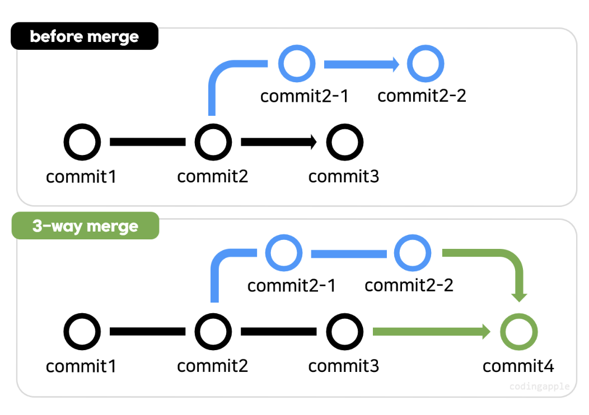
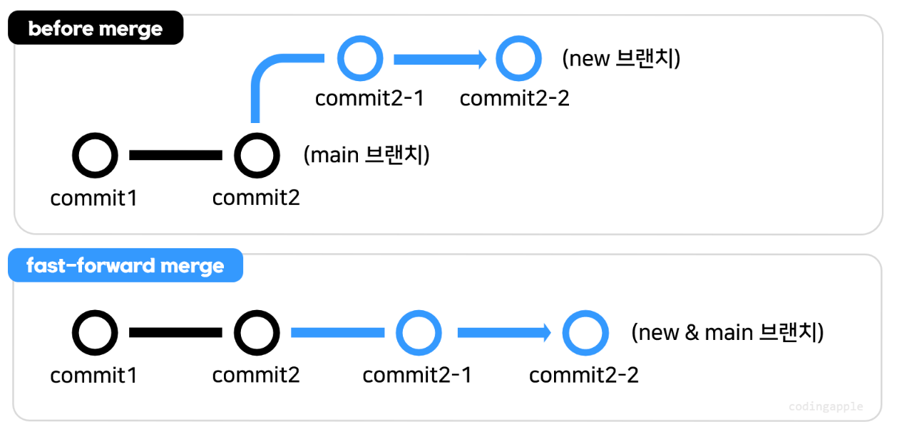
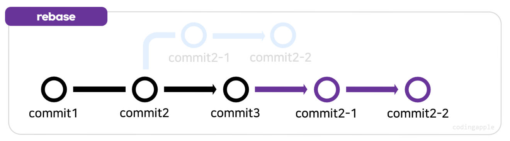
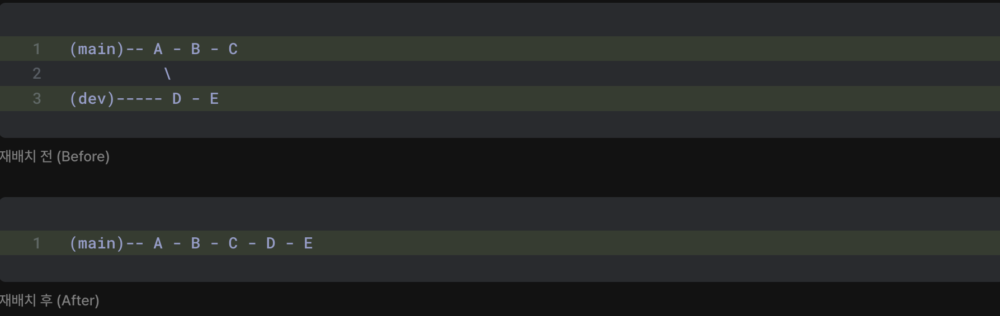
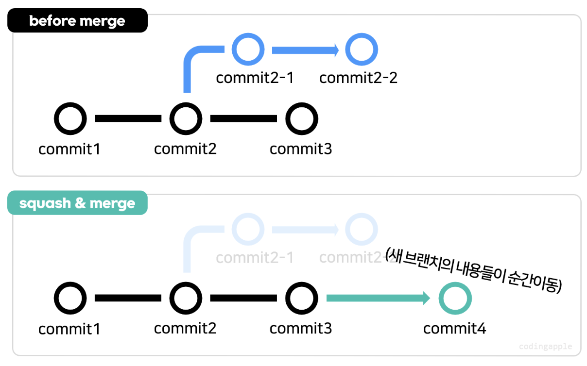

# [ TIL | Git ] merge / rebase / squash

## 1️⃣ git merge의 종류

> ☝️ 3-way merge
> 
> 
> 
> 

<aside>
📌

검정색 branch 가 <dev>, 파란색 branch가 <dev/기능명>이라고 한다면

<dev>브랜치는 <dev/기능명>브랜치의 부모 역할을 한다. 

각각의 브랜치에서 신규 커밋이 1회 이상 있는 경우

merge시 두 브랜치의 코드를 합쳐서 ‘commit4 ’와 같은 새로운 커밋을 만든다

</aside>

> ✌️ fast-forward merge
> 
> 
> 
> 

<aside>
📌

<dev/기능명>브랜치에만 커밋이 있고, <dev>브랜치에는 신규 커밋이 없는 경우

즉 부모역할을 하는 브랜치에는 신규 커밋이 없는 경우는 fast-forward merge가 됨

merge commit이 생성되지 않고 HEAD가 움직이는 것!

fast-forward 방식은, 병합에 사용되는 브랜치가 병합하려는 브랜치의 모든 커밋내역을 가지고 있다면 병합할 때 단순히 커밋이 “이동” 된다.


</aside>

<aside>
💡

`git branch -d 브랜치이름`  `git branch -D 브랜치이름`  의 차이!

병합이 완료된 브랜치 삭제시엔 -d 사용

병합하지 않은 브랜치 삭제시엔 -D 사용

</aside>

---

## 2️⃣ git rebase 란?

→ `재배치(Rebase)` 는 현재 브랜치의 내역을 대상 브랜치의 최신 버전 다음으로 배치(이동)하는 기능



즉, rebase를 이용해 신규 브랜치의 시작점을 main 브랜치의 최근 커밋으로 옮겨 fast-forward merge하는 것!

<aside>

 🧐 rebase 맛보기

→ 다음은 `dev` 브랜치를 `main` 브랜치로 재배치하는 과정

1. `git checkout dev`: 재배치할 브랜치로 전환.
2. `git rebase main`: 현재 브랜치(`dev`)를 대상 브랜치(`main`)로 재배치 시작
3. 충돌(Conflict) 발생 시 해결.
4. `git add .`: 충돌 해결 후 스테이징.
5. `git rebase --continue`: 재배치 계속 진행.
6. 버전 메시지 수정 및 저장(`:wq`).
7. 3~6번 과정 반복 및 재배치 완료!



</aside>

### ❗rebase 명령어

| 명령 | 설명 | 예시 / 특이사항 |
| --- | --- | --- |
| **`git rebase <브랜치>`** | 현재 브랜치를 대상 브랜치로 재배치 | **`git rebase main`** |
| **`git rebase --continue`** | 재배치 계속 진행 |  |
| `git rebase --abort` | git rebase 호출 이전의 분기 상태로 되돌림 |  |
| `git rebase --skip` | 대상 브랜치의 내용으로 강제 병함 실행 | 거의 사용하지 않음 |

### ❗rebase 하는 이유!

1. 3-way merge 싫고, 강제로 fast-forward 하고 싶을 때 
2. 브랜치 커밋을 깔끔하게 정리하고 싶을때
3. commit 내역을 한 줄로 계속 이어서 남기고 싶을 때

### ❗rebase & merge 사용 방법!

→ 새로운브랜치의 커밋을 main에 rebase & merge로 강제 fast-forward 해주고 싶은 상황일 때 사용

```jsx
git switch 새로운브랜치
git rebase main

git switch main
git merge 새로운브랜치
```

---

## 3️⃣ git squash 란?

→ `git squash` 는 여러 개의 커밋을 하나의 커밋으로 합치는 방법이다.
이렇게 하면 여러 개의 중간 커밋들을 깔끔하게 정리하여 하나의 의미 있는 커밋으로 만들 수 있음!



3-way처럼 선으로 이어주지 않고, 새 브랜치의 코드 변경사항들을 병합하는 브랜치로 `텔레포트` 시켜주는 것!

### ❗squash & merge 사용 방법!

```jsx
git switch main
git merge --squash 브랜치명 // 여러분이 브랜치에서 만들었던 커밋들을 다 합쳐서
git commit -m "message" // 하나의 커밋으로 main 브랜치에 생성해주는 과정임.
```

---

## 4️⃣ squash and merge with rebase 해보기

이 방법의 정식 명칭은, `git rebase interactive` 라고 한다 → 기존 커밋을 수정, 삭제, 이동, 생성이 가능!

### ❗Git rebase interactive 사용 방법!

1. `git rebaes -i 수정할_커밋의_직전_커밋아이디` or `git rebase -i HEAD~숫자`
    1. `git rebaes -i 수정할_커밋의_직전_커밋아이디` : 여기에 적은 커밋아이디 그 다음부터 현재 커밋까지 모든 커밋을 가져옴 (추천방법)
    2. `git rebase -i HEAD~3` : 최신 커밋으로부터 HEAD 포함하여 3번째 커밋까지 가져옴
2. 입력하면 5가지 옵션 사용이 가능함
    
    ```jsx
    pick - 커밋 순서를 재정렬하거나 해당 커밋을 수정 없이 그대로 사용한다는 의미
    reword - 커밋 메시지 수정
    edit - 커밋 수정
    squash - 이전 커밋과 merge하여 단일 커밋으로 변경
    fixup - squash와 비슷하지만 기존 커밋 메시지를 무시
    drop - 커밋을 삭제
    ```
    
3. 5가지 옵션 중 원하는 동작 선택하고 continue를 통해 작업 완료
    
    `git rebase --continue`
    

---

- 💭 느낀점
    
    이전에는 3-way merge를 주로 사용했었는데, log보기가 싫었던 이유를 알게됨 ㅎㅎ
    마지막 Git rebase interactive 실습이 가장 어려웠음🥲 혼자서 실습 다시한번 해보기로!
    squash & merge는 자주 쓸 것 같다!!